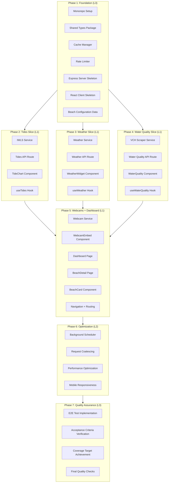

# Van Beaches Work Plan

**Created**: 2026-01-17
**Design Doc**: [van-beaches-design.md](/docs/design/van-beaches-design.md)
**Status**: Not Started

## Overview

This work plan outlines the implementation tasks for the Van Beaches web dashboard application. The project follows a **Vertical Slice with Foundation Layer** approach as specified in the Design Doc.

### Implementation Approach

- **Strategy**: Vertical Slice with Foundation Layer
- **Verification Levels**: L1 (Functional), L2 (Test), L3 (Build)
- **E2E Test Skeletons**: Pre-generated at `/client/e2e/`

### Key Constraints

| Constraint | Details |
|------------|---------|
| IWLS API Rate Limit | 3 requests/second |
| VCH Water Quality | Web scraping required (no official API) |
| Weather API | No guaranteed SLA from Environment Canada |
| Webcam Availability | Varies by beach |

---

## Phase Structure Diagram



---

## Task Dependency Diagram

```mermaid
flowchart LR
    subgraph Foundation["Foundation Layer"]
        Types[Shared Types]
        Cache[Cache Manager]
        RateLimiter[Rate Limiter]
        BeachConfig[Beach Config]
    end

    subgraph Server["Server Layer"]
        Express[Express Server]
        IWLS[IWLS Service]
        Weather[Weather Service]
        WaterQuality[Water Quality Service]
        Webcam[Webcam Service]
        TideRoute[/api/tides]
        WeatherRoute[/api/weather]
        WQRoute[/api/water-quality]
        Scheduler[Background Jobs]
    end

    subgraph Client["Client Layer"]
        ReactApp[React App]
        TideChart[TideChart]
        WeatherWidget[WeatherWidget]
        WQIndicator[WaterQuality]
        WebcamEmbed[WebcamEmbed]
        Dashboard[Dashboard Page]
        Detail[Beach Detail Page]
    end

    Types --> Cache
    Types --> Express
    Types --> ReactApp
    Cache --> IWLS
    Cache --> Weather
    Cache --> WaterQuality
    RateLimiter --> IWLS
    BeachConfig --> IWLS
    BeachConfig --> Weather
    BeachConfig --> WaterQuality
    BeachConfig --> Webcam

    IWLS --> TideRoute
    Weather --> WeatherRoute
    WaterQuality --> WQRoute

    Express --> TideRoute
    Express --> WeatherRoute
    Express --> WQRoute

    TideRoute --> TideChart
    WeatherRoute --> WeatherWidget
    WQRoute --> WQIndicator
    Webcam --> WebcamEmbed

    TideChart --> Detail
    WeatherWidget --> Detail
    WQIndicator --> Detail
    WebcamEmbed --> Detail
    Detail --> Dashboard

    TideRoute --> Scheduler
    WeatherRoute --> Scheduler
    WQRoute --> Scheduler
```

---

## Phase 1: Foundation (L3 Verification)

**Goal**: Establish monorepo structure, shared types, caching infrastructure, and application skeletons.

**Quality Gate**: Build passes, type definitions compile without errors.

### Tasks

#### Task 1.1: Monorepo Setup with pnpm Workspaces

- [ ] **Implementation**
  - Initialize pnpm workspace configuration
  - Create `/server`, `/client`, `/shared` directory structure
  - Configure root `package.json` with workspace definition
  - Set up TypeScript project references
  - Configure shared ESLint and Prettier rules
- **Completion Criteria**:
  - `pnpm install` succeeds from root
  - `pnpm -r build` runs across all packages
  - TypeScript path aliases resolve correctly
- **Dependencies**: None
- **Files**: `package.json`, `pnpm-workspace.yaml`, `tsconfig.json`

#### Task 1.2: Shared Types Package

- [ ] **Implementation**
  - Create `/shared/types/beach.ts` with Beach, BeachSummary interfaces
  - Create `/shared/types/weather.ts` with WeatherCondition, WeatherForecast
  - Create `/shared/types/tide.ts` with TidePrediction, TideData
  - Create `/shared/types/waterQuality.ts` with WaterQualityLevel, WaterQualityStatus
  - Create `/shared/types/api.ts` with ApiResponse, ApiError
  - Create `/shared/types/index.ts` barrel export
  - Add unit tests for type guards
- **Completion Criteria**:
  - All types from Design Doc section "Type Definitions" implemented
  - Type guards pass unit tests
  - Package builds and exports correctly
- **Dependencies**: Task 1.1
- **AC Support**: All AC properties referencing types (5 items)
- **Files**: `/shared/types/*.ts`

#### Task 1.3: Cache Manager Implementation

- [ ] **Implementation**
  - Create `/server/src/cache/cacheManager.ts`
  - Implement in-memory Map with TTL tracking
  - Implement LRU eviction (max 1000 entries)
  - Implement `getOrFetch` with request coalescing
  - Implement cache statistics tracking
  - Add unit tests for TTL expiration, LRU eviction, coalescing
- **Completion Criteria**:
  - All interfaces from Design Doc "Cache Manager" section implemented
  - Unit tests cover TTL, LRU, coalescing scenarios
  - Coverage >= 80% for cache module
- **Dependencies**: Task 1.2 (types)
- **AC Support**: AC "The server shall cache all external API responses"
- **Property Tests**:
  - `weatherCache.ttl === 1800000`
  - `waterQualityCache.ttl === 21600000`
- **Files**: `/server/src/cache/cacheManager.ts`, `/server/src/cache/__tests__/cacheManager.test.ts`

#### Task 1.4: Rate Limiter Implementation

- [ ] **Implementation**
  - Create `/server/src/cache/rateLimiter.ts`
  - Implement token bucket algorithm for IWLS (3 req/sec)
  - Implement `acquireSlot` and `release` methods
  - Add slot queue for rate-limited requests
  - Add unit tests for rate limiting scenarios
- **Completion Criteria**:
  - Rate limiter enforces 3 req/sec limit for IWLS
  - Queued requests are processed when slots available
  - Unit tests pass for burst and sustained load
- **Dependencies**: Task 1.1
- **AC Support**: AC "If the IWLS API rate limit is exceeded, then serve cached data"
- **Files**: `/server/src/cache/rateLimiter.ts`, `/server/src/cache/__tests__/rateLimiter.test.ts`

#### Task 1.5: Express Server Skeleton

- [ ] **Implementation**
  - Create `/server/src/index.ts` with Express setup
  - Configure CORS, helmet, JSON middleware
  - Set up error handling middleware
  - Configure structured logging (pino recommended)
  - Add health check endpoint `/api/health`
  - Add unit tests for middleware and error handling
- **Completion Criteria**:
  - Server starts and responds to health check
  - Error responses follow ApiError format from Design Doc
  - Logging outputs structured JSON
- **Dependencies**: Task 1.2 (types)
- **Files**: `/server/src/index.ts`, `/server/src/middleware/*.ts`

#### Task 1.6: React Client Skeleton with Vite

- [ ] **Implementation**
  - Initialize Vite + React + TypeScript project in `/client`
  - Configure path aliases to shared types
  - Set up React Router for navigation
  - Configure Tailwind CSS
  - Create base layout component
  - Add placeholder pages (Dashboard, BeachDetail)
- **Completion Criteria**:
  - `pnpm dev` starts development server
  - Routes `/` and `/beach/:slug` render placeholders
  - Tailwind styles apply correctly
- **Dependencies**: Task 1.1, Task 1.2
- **Files**: `/client/src/**/*`, `/client/vite.config.ts`, `/client/tailwind.config.js`

#### Task 1.7: Beach Configuration Data

- [ ] **Implementation**
  - Create `/shared/data/beaches.ts` with all 9 beach entries
  - Include coordinates, tide station mappings, webcam URLs
  - Create helper functions for beach lookup by ID/slug
  - Add unit tests for data integrity
- **Completion Criteria**:
  - All 9 beaches from Design Doc "Vancouver Beaches Configuration" included
  - `beachTideStationMap.size === 9` (property validation)
  - Trout Lake has `tideStationId: null`
- **Dependencies**: Task 1.2
- **AC Support**: AC "Beach count is always 9", AC "beachTideStationMap.size === 9"
- **Files**: `/shared/data/beaches.ts`, `/shared/data/__tests__/beaches.test.ts`

### Phase 1 Quality Gate

- [ ] `pnpm -r build` passes
- [ ] `pnpm -r type-check` passes
- [ ] `pnpm -r test` passes with >= 70% coverage
- [ ] All shared types compile and export correctly

---

## Phase 2: First Vertical Slice - Tides (L1 Verification)

**Goal**: Complete end-to-end tide data flow from IWLS API to user interface.

**Quality Gate**: User can view tide data for any beach with webcam fallback.

### Tasks

#### Task 2.1: IWLS Service with API Integration

- [ ] **Implementation**
  - Create `/server/src/services/iwlsService.ts`
  - Implement `getTidePredictions(stationId, from, to)` method
  - Integrate with Rate Limiter
  - Integrate with Cache Manager
  - Handle HTTP 429 (rate limit) response gracefully
  - Transform API response to TidePrediction[] type
  - Add unit tests with mocked HTTP client
  - Add integration test with sandbox/live API
- **Completion Criteria**:
  - Service returns typed TidePrediction array
  - Rate limiting prevents API abuse
  - Cached data served when rate limited
  - Error handling follows Design Doc patterns
- **Dependencies**: Task 1.3, Task 1.4, Task 1.7
- **AC Support**:
  - AC "When a user views a beach, display next 3 high and low tides"
  - AC "If IWLS API rate limit exceeded, serve cached data"
- **Files**: `/server/src/services/iwlsService.ts`, `/server/src/services/__tests__/iwlsService.test.ts`

#### Task 2.2: Tides API Route

- [ ] **Implementation**
  - Create `/server/src/routes/tidesRoute.ts`
  - Implement `GET /api/tides/:beachId` endpoint
  - Validate beachId against known beaches
  - Map beachId to tide station via beach config
  - Return ApiResponse<TideData> format
  - Handle Trout Lake case (return "not applicable" message)
  - Add integration tests with supertest
- **Completion Criteria**:
  - Endpoint returns properly formatted tide data
  - Invalid beachId returns 404 with ApiError
  - Trout Lake returns appropriate message
  - Response includes cached/cachedAt metadata
- **Dependencies**: Task 2.1, Task 1.5
- **AC Support**: AC "If beach has no tide station, display 'Tide information not applicable'"
- **Files**: `/server/src/routes/tidesRoute.ts`, `/server/src/routes/__tests__/tidesRoute.test.ts`

#### Task 2.3: useTides Custom Hook

- [ ] **Implementation**
  - Create `/client/src/hooks/useTides.ts`
  - Implement data fetching with loading/error states
  - Handle refetch on beachId change
  - Implement stale-while-revalidate pattern
  - Add unit tests with mocked fetch
- **Completion Criteria**:
  - Hook returns `{ tides, loading, error, refetch }`
  - Loading state shown during fetch
  - Error state populated on failure
  - Refetch available for manual refresh
- **Dependencies**: Task 1.6, Task 2.2
- **Files**: `/client/src/hooks/useTides.ts`, `/client/src/hooks/__tests__/useTides.test.ts`

#### Task 2.4: TideChart Component

- [ ] **Implementation**
  - Create `/client/src/components/TideChart.tsx`
  - Display tide timeline with high/low markers
  - Format times in 12-hour Pacific Time (h:mm A)
  - Format heights in meters with 2 decimal precision
  - Show loading skeleton during fetch
  - Handle error state display
  - Add unit tests for formatting logic
  - Add visual regression tests (optional)
- **Completion Criteria**:
  - Component renders tide predictions visually
  - Times display as "2:30 PM" format
  - Heights display as "3.45 m" format
  - Accessible with proper ARIA labels
- **Dependencies**: Task 2.3
- **AC Support**:
  - AC "Tide times in Pacific Time 12-hour format" (property: `tideTime.format === 'h:mm A'`)
  - AC "Tide heights in meters with two decimal precision"
- **Files**: `/client/src/components/TideChart.tsx`, `/client/src/components/__tests__/TideChart.test.ts`

### Phase 2 Integration Verification

- [ ] Navigate to `/beach/english-bay` and verify tide chart displays
- [ ] Verify tide data shows 6 predictions (3 high, 3 low)
- [ ] Verify `/beach/trout-lake` shows "Tide information not applicable"
- [ ] Verify rate limiting activates under load (dev tools simulation)
- [ ] Test case resolution: 4/4 tide-related tests implemented

### Phase 2 Quality Gate

- [ ] `pnpm -r build` passes
- [ ] `pnpm -r test` passes with >= 70% coverage
- [ ] E2E: User can view tide data for English Bay
- [ ] E2E: Trout Lake shows appropriate message

---

## Phase 3: Weather Slice (L1 Verification)

**Goal**: Complete end-to-end weather data flow from MSC GeoMet API to user interface.

**Quality Gate**: User can view weather forecast for any beach.

### Tasks

#### Task 3.1: Weather Service with MSC GeoMet Integration

- [ ] **Implementation**
  - Create `/server/src/services/weatherService.ts`
  - Implement `getWeatherForecast(lat, lon)` method
  - Integrate with Cache Manager (30-minute TTL)
  - Transform OGC API response to WeatherForecast type
  - Map weather conditions to WeatherCondition enum
  - Handle API timeout (>5s) gracefully
  - Add unit tests with mocked responses
- **Completion Criteria**:
  - Service returns typed WeatherForecast
  - Temperature in Celsius with proper precision
  - 24-hour forecast with hourly entries
  - Cached data served on API failure
- **Dependencies**: Task 1.3, Task 1.7
- **AC Support**:
  - AC "When user views beach detail, display 24-hour weather forecast"
  - AC "Weather data refresh every 30 minutes" (property: `weatherCache.ttl === 1800000`)
- **Files**: `/server/src/services/weatherService.ts`, `/server/src/services/__tests__/weatherService.test.ts`

#### Task 3.2: Weather API Route

- [ ] **Implementation**
  - Create `/server/src/routes/weatherRoute.ts`
  - Implement `GET /api/weather/:beachId` endpoint
  - Validate beachId against known beaches
  - Look up beach coordinates from config
  - Return ApiResponse<WeatherForecast> format
  - Add integration tests with supertest
- **Completion Criteria**:
  - Endpoint returns properly formatted weather data
  - Invalid beachId returns 404
  - Response includes cached metadata
  - Hourly forecast contains 24 entries
- **Dependencies**: Task 3.1, Task 1.5
- **Files**: `/server/src/routes/weatherRoute.ts`, `/server/src/routes/__tests__/weatherRoute.test.ts`

#### Task 3.3: useWeather Custom Hook

- [ ] **Implementation**
  - Create `/client/src/hooks/useWeather.ts`
  - Implement data fetching with loading/error states
  - Handle refetch on beachId change
  - Add unit tests with mocked fetch
- **Completion Criteria**:
  - Hook returns `{ weather, loading, error, refetch }`
  - Proper state management during fetch cycle
- **Dependencies**: Task 1.6, Task 3.2
- **Files**: `/client/src/hooks/useWeather.ts`, `/client/src/hooks/__tests__/useWeather.test.ts`

#### Task 3.4: WeatherWidget Component

- [ ] **Implementation**
  - Create `/client/src/components/WeatherWidget.tsx`
  - Display current conditions with temperature, icon
  - Display 24-hour forecast timeline
  - Temperature with one decimal precision (15.5C)
  - Weather condition icons for each condition type
  - Show "Last updated" timestamp when cached
  - Show loading skeleton during fetch
  - Add unit tests for display logic
- **Completion Criteria**:
  - Component renders current and forecast weather
  - Temperature displays as "15.5C" format
  - Weather icons match conditions
  - Cached indicator visible when applicable
- **Dependencies**: Task 3.3
- **AC Support**:
  - AC "Temperature in Celsius with one decimal precision"
  - AC "Weather conditions with appropriate icons"
  - AC "If API error, display cached data with timestamp"
- **Files**: `/client/src/components/WeatherWidget.tsx`, `/client/src/components/__tests__/WeatherWidget.test.ts`

### Phase 3 Integration Verification

- [ ] Navigate to `/beach/english-bay` and verify weather widget displays
- [ ] Verify temperature shows one decimal precision
- [ ] Verify 24-hour forecast shows hourly entries
- [ ] Verify cached data indicator appears when API fails (mock)
- [ ] Test case resolution: 4/4 weather-related tests implemented

### Phase 3 Quality Gate

- [ ] `pnpm -r build` passes
- [ ] `pnpm -r test` passes with >= 70% coverage
- [ ] E2E: User can view weather for any beach

---

## Phase 4: Water Quality Slice (L1 Verification)

**Goal**: Complete end-to-end water quality data flow from VCH scraping to user interface.

**Quality Gate**: User can view water quality status for any beach.

### Tasks

#### Task 4.1: VCH Scraper Service

- [ ] **Implementation**
  - Create `/server/src/services/waterQualityService.ts`
  - Implement `getWaterQuality(beachName)` method
  - Use cheerio for HTML parsing
  - Parse water quality status (Good/Advisory/Closed)
  - Extract E.coli counts and sample dates
  - Integrate with Cache Manager (6-hour TTL)
  - Handle off-season detection (October-April)
  - Handle parse failures gracefully
  - Add unit tests with saved HTML fixtures
  - Add integration test with live VCH site
- **Completion Criteria**:
  - Service returns typed WaterQualityStatus
  - Status correctly parsed from HTML
  - Advisory reason extracted when applicable
  - Off-season returns appropriate status
  - Parse failures logged and cached data served
- **Dependencies**: Task 1.3, Task 1.7
- **AC Support**:
  - AC "Display water quality status as Good/Advisory/Closed/Unknown/Off-Season"
  - AC "When Advisory or Closed, display advisory reason"
  - AC "Display date of last water quality sample"
  - AC "If off-season, display 'Monitoring resumes in May'"
- **Risk Mitigation**: Snapshot tests detect HTML structure changes
- **Files**: `/server/src/services/waterQualityService.ts`, `/server/src/services/__tests__/waterQualityService.test.ts`, `/server/src/services/__tests__/fixtures/vch-*.html`

#### Task 4.2: Water Quality API Route

- [ ] **Implementation**
  - Create `/server/src/routes/waterQualityRoute.ts`
  - Implement `GET /api/water-quality/:beachId` endpoint
  - Validate beachId against known beaches
  - Return ApiResponse<WaterQualityStatus> format
  - Add integration tests
- **Completion Criteria**:
  - Endpoint returns properly formatted water quality data
  - Invalid beachId returns 404
  - Response includes cached metadata
- **Dependencies**: Task 4.1, Task 1.5
- **Files**: `/server/src/routes/waterQualityRoute.ts`, `/server/src/routes/__tests__/waterQualityRoute.test.ts`

#### Task 4.3: useWaterQuality Custom Hook

- [ ] **Implementation**
  - Create `/client/src/hooks/useWaterQuality.ts`
  - Implement data fetching with loading/error states
  - Add unit tests
- **Completion Criteria**:
  - Hook returns `{ waterQuality, loading, error, refetch }`
- **Dependencies**: Task 1.6, Task 4.2
- **Files**: `/client/src/hooks/useWaterQuality.ts`, `/client/src/hooks/__tests__/useWaterQuality.test.ts`

#### Task 4.4: WaterQuality Component

- [ ] **Implementation**
  - Create `/client/src/components/WaterQuality.tsx`
  - Display status badge with color coding (green/yellow/red)
  - Display advisory reason when applicable
  - Display last sample date
  - Display off-season message when applicable
  - Show loading skeleton during fetch
  - Add unit tests
- **Completion Criteria**:
  - Component renders status with appropriate colors
  - Advisory reason visible for Advisory/Closed
  - Sample date displayed
  - Off-season message shown October-April
- **Dependencies**: Task 4.3
- **AC Support**: All Water Quality Feature ACs
- **Files**: `/client/src/components/WaterQuality.tsx`, `/client/src/components/__tests__/WaterQuality.test.ts`

### Phase 4 Integration Verification

- [ ] Navigate to `/beach/english-bay` and verify water quality displays
- [ ] Verify status badge colors match status
- [ ] Verify sample date is displayed
- [ ] Mock off-season date and verify message
- [ ] Test case resolution: 4/4 water quality-related tests implemented

### Phase 4 Quality Gate

- [ ] `pnpm -r build` passes
- [ ] `pnpm -r test` passes with >= 70% coverage
- [ ] E2E: User can view water quality for any beach
- [ ] VCH scraper handles current HTML structure

---

## Phase 5: Webcams + Dashboard (L1 Verification)

**Goal**: Complete dashboard with all beach cards, detail pages, and webcam integration.

**Quality Gate**: Full user experience available - dashboard shows all beaches, detail pages show all data.

### Tasks

#### Task 5.1: Webcam Service

- [ ] **Implementation**
  - Create `/server/src/services/webcamService.ts`
  - Implement `getWebcamUrl(beachId)` method
  - Return embed URL or null from beach config
  - No external API calls (static configuration)
  - Add unit tests
- **Completion Criteria**:
  - Service returns correct URLs for beaches with webcams
  - Service returns null for beaches without webcams
  - English Bay, Jericho, Kitsilano have URLs
- **Dependencies**: Task 1.7
- **Files**: `/server/src/services/webcamService.ts`, `/server/src/services/__tests__/webcamService.test.ts`

#### Task 5.2: WebcamEmbed Component

- [ ] **Implementation**
  - Create `/client/src/components/WebcamEmbed.tsx`
  - Implement lazy loading (Intersection Observer or loading="lazy")
  - Display loading skeleton while loading
  - Display placeholder with "Webcam unavailable" when URL is null
  - Sandbox iframe for security
  - Add unit tests
- **Completion Criteria**:
  - Webcam loads lazily (not on initial page load)
  - Skeleton visible during loading
  - Placeholder shown for beaches without webcam
  - iframe has sandbox attribute
- **Dependencies**: Task 5.1
- **AC Support**:
  - AC "When webcam available, embed live feed"
  - AC "If webcam fails to load, display placeholder"
  - AC "Webcam embeds lazy-loaded"
  - AC "While loading, display skeleton"
- **Files**: `/client/src/components/WebcamEmbed.tsx`, `/client/src/components/__tests__/WebcamEmbed.test.ts`

#### Task 5.3: BeachCard Component

- [ ] **Implementation**
  - Create `/client/src/components/BeachCard.tsx`
  - Display beach name, current weather summary
  - Display next tide indicator
  - Display water quality status badge
  - Display "Data unavailable" with timestamp on failure
  - Link to beach detail page
  - Add unit tests
- **Completion Criteria**:
  - Card shows all summary information
  - Card links to `/beach/:slug`
  - Data unavailable state handled
- **Dependencies**: Task 1.2
- **AC Support**: AC "Display each beach with name, conditions summary, status indicators"
- **Files**: `/client/src/components/BeachCard.tsx`, `/client/src/components/__tests__/BeachCard.test.ts`

#### Task 5.4: useBeaches Custom Hook

- [ ] **Implementation**
  - Create `/client/src/hooks/useBeaches.ts`
  - Fetch `/api/beaches` for dashboard summary
  - Implement loading/error states
  - Add unit tests
- **Completion Criteria**:
  - Hook returns `{ beaches, loading, error, refetch }`
  - Returns array of 9 BeachSummary objects
- **Dependencies**: Task 1.6
- **Files**: `/client/src/hooks/useBeaches.ts`, `/client/src/hooks/__tests__/useBeaches.test.ts`

#### Task 5.5: Beaches API Route (Summary Endpoint)

- [ ] **Implementation**
  - Create `/server/src/routes/beachesRoute.ts`
  - Implement `GET /api/beaches` endpoint
  - Aggregate summary data from all services
  - Return ApiResponse<BeachSummary[]>
  - Add integration tests
- **Completion Criteria**:
  - Returns 9 beach summaries
  - Each summary includes current weather, next tide, water quality
  - Handles partial failures gracefully
- **Dependencies**: Task 2.1, Task 3.1, Task 4.1
- **AC Support**: AC "Display all 9 Vancouver beaches", property `beaches.length === 9`
- **Files**: `/server/src/routes/beachesRoute.ts`, `/server/src/routes/__tests__/beachesRoute.test.ts`

#### Task 5.6: Dashboard Page

- [ ] **Implementation**
  - Create `/client/src/pages/Dashboard.tsx`
  - Display grid of 9 BeachCard components
  - Implement responsive layout (1/2/3 columns)
  - Handle loading state with skeleton cards
  - Handle error state with retry option
  - Add unit tests
- **Completion Criteria**:
  - 9 beach cards displayed in grid
  - Responsive layout works at all breakpoints
  - Loading skeletons shown during fetch
  - Error state allows retry
- **Dependencies**: Task 5.3, Task 5.4
- **AC Support**:
  - AC "Display all 9 Vancouver beaches"
  - AC "Support viewport widths 320px to 2560px"
- **Files**: `/client/src/pages/Dashboard.tsx`, `/client/src/pages/__tests__/Dashboard.test.ts`

#### Task 5.7: BeachDetail Page

- [ ] **Implementation**
  - Create `/client/src/pages/BeachDetail.tsx`
  - Integrate WeatherWidget, TideChart, WaterQuality, WebcamEmbed
  - Display beach name and navigation back to dashboard
  - Handle beachId route parameter
  - Handle invalid beach ID (404 page)
  - Add unit tests
- **Completion Criteria**:
  - All four widgets display for valid beach
  - 404 shown for invalid beach slug
  - Navigation back to dashboard works
- **Dependencies**: Task 2.4, Task 3.4, Task 4.4, Task 5.2
- **Files**: `/client/src/pages/BeachDetail.tsx`, `/client/src/pages/__tests__/BeachDetail.test.ts`

#### Task 5.8: Navigation and Routing

- [ ] **Implementation**
  - Update React Router configuration
  - Add navigation header component
  - Implement breadcrumbs on detail page
  - Add 404 page for invalid routes
  - Add unit tests
- **Completion Criteria**:
  - `/` renders Dashboard
  - `/beach/:slug` renders BeachDetail
  - Invalid routes show 404
  - Navigation header on all pages
- **Dependencies**: Task 5.6, Task 5.7
- **Files**: `/client/src/App.tsx`, `/client/src/components/Navigation.tsx`, `/client/src/pages/NotFound.tsx`

### Phase 5 Integration Verification

- [ ] Navigate to `/` and verify 9 beach cards display
- [ ] Click beach card and verify navigation to detail page
- [ ] Verify all 4 widgets display on detail page
- [ ] Verify webcam lazy loads (not loaded until scrolled to)
- [ ] Navigate to `/beach/locarno-beach` and verify "Webcam unavailable"
- [ ] Test mobile viewport (375px) navigation
- [ ] Test tablet viewport (768px) layout
- [ ] Test desktop viewport (1920px) layout
- [ ] Test case resolution: Dashboard tests 6/6, Beach Detail tests 15/15

### Phase 5 Quality Gate

- [ ] `pnpm -r build` passes
- [ ] `pnpm -r test` passes with >= 70% coverage
- [ ] E2E: Complete user flow (dashboard -> detail -> back)
- [ ] E2E: Responsive layouts at all breakpoints

---

## Phase 6: Optimization (L2 Verification)

**Goal**: Implement background refresh, request coalescing, and performance optimizations.

**Quality Gate**: Performance targets met, background jobs running correctly.

### Tasks

#### Task 6.1: Background Scheduler

- [ ] **Implementation**
  - Create `/server/src/jobs/scheduler.ts`
  - Implement cron-based job scheduling (node-cron)
  - Create `/server/src/jobs/dataRefreshJob.ts`
  - Schedule weather refresh every 30 minutes
  - Schedule water quality refresh every 6 hours
  - Implement job status logging
  - Add unit tests for scheduler logic
- **Completion Criteria**:
  - Jobs run at scheduled intervals
  - Cache updated proactively
  - Job failures logged, do not crash server
- **Dependencies**: Task 2.1, Task 3.1, Task 4.1
- **AC Support**: AC "Auto-refresh data at appropriate intervals"
- **Files**: `/server/src/jobs/scheduler.ts`, `/server/src/jobs/dataRefreshJob.ts`, `/server/src/jobs/__tests__/*.test.ts`

#### Task 6.2: Request Coalescing Enhancement

- [ ] **Implementation**
  - Enhance Cache Manager with in-flight request tracking
  - Prevent duplicate concurrent API calls for same key
  - Multiple requests receive same Promise
  - Add unit tests for concurrent request scenarios
- **Completion Criteria**:
  - Concurrent requests for same data coalesced
  - Only one external API call made per unique key
  - All waiting requests receive result
- **Dependencies**: Task 1.3
- **AC Support**: AC "Implement request coalescing for concurrent requests"
- **Files**: `/server/src/cache/cacheManager.ts` (enhancement)

#### Task 6.3: Performance Optimization

- [ ] **Implementation**
  - Implement response compression (gzip)
  - Add ETags for conditional requests
  - Optimize client bundle size (code splitting)
  - Implement image optimization for weather icons
  - Add performance monitoring endpoints
  - Add load tests
- **Completion Criteria**:
  - Initial page load < 3 seconds (AC)
  - Data refresh < 1 second (AC)
  - Bundle size optimized
- **Dependencies**: All previous phases
- **AC Support**:
  - AC "Initial page load < 3 seconds"
  - AC "Data refresh < 1 second"
- **Files**: Various server and client files

#### Task 6.4: Mobile Responsiveness Polish

- [ ] **Implementation**
  - Audit and fix mobile layout issues
  - Implement touch-friendly tap targets (44px minimum)
  - Test on actual mobile devices or emulators
  - Fix any overflow or scrolling issues
  - Add viewport meta tags if missing
- **Completion Criteria**:
  - All features usable on 320px viewport
  - Touch targets meet accessibility guidelines
  - No horizontal scroll on mobile
- **Dependencies**: Phase 5
- **AC Support**: AC "Mobile-responsive layout with touch-friendly navigation"
- **Files**: Various client CSS/component files

### Phase 6 Quality Gate

- [ ] `pnpm -r build` passes
- [ ] `pnpm -r test` passes with >= 70% coverage
- [ ] Performance: Dashboard loads < 3s
- [ ] Performance: Data refresh < 1s
- [ ] Background jobs running correctly

---

## Phase 7: Quality Assurance (L3 Verification)

**Goal**: Achieve all acceptance criteria, pass all tests, complete quality checks.

**Quality Gate**: Production-ready release.

### Tasks

#### Task 7.1: E2E Test Implementation

- [ ] **Implementation**
  - Complete E2E tests in `client/e2e/dashboard.spec.ts` (6 tests)
  - Complete E2E tests in `client/e2e/beach-detail.spec.ts` (15 tests)
  - Complete E2E tests in `client/e2e/caching-performance.spec.ts` (6 tests)
  - Add API mocking for failure scenarios
  - Add mobile viewport tests
- **Completion Criteria**:
  - All E2E test skeletons converted to passing tests
  - Tests cover all critical user paths
  - Tests handle API failure scenarios
- **Dependencies**: Phase 5, Phase 6
- **Test Case Resolution**: 27/27 E2E tests passing
- **Files**: `client/e2e/*.spec.ts`

#### Task 7.2: Acceptance Criteria Verification

- [ ] **Verification Checklist**
  - [ ] Beach Dashboard Display: All 9 beaches shown
  - [ ] Property: `beaches.length === 9`
  - [ ] Property: `responsive.breakpoints.includes(['mobile', 'tablet', 'desktop'])`
  - [ ] Weather: 24-hour forecast displays
  - [ ] Property: `weatherCache.ttl === 1800000`
  - [ ] Tides: 3 high and 3 low tides shown
  - [ ] Property: `tideTime.format === 'h:mm A'`
  - [ ] Property: `beachTideStationMap.size === 9`
  - [ ] Water Quality: Status badge with colors
  - [ ] Property: `waterQualityCache.ttl === 21600000`
  - [ ] Property: `lastSampleDate instanceof Date`
  - [ ] Webcams: Lazy load and placeholder
  - [ ] Caching: Last updated timestamp shown
  - [ ] Performance: Initial load < 3s
  - [ ] Performance: Data refresh < 1s
  - [ ] Error handling: Graceful degradation on API failure
- **Completion Criteria**:
  - All Design Doc acceptance criteria verified
  - All property-based criteria validated
- **Dependencies**: All phases

#### Task 7.3: Coverage Target Achievement

- [ ] **Implementation**
  - Review coverage report
  - Add tests for uncovered code paths
  - Target: 80% coverage (Design Doc), minimum 70% (technical-spec)
  - Ensure critical paths have 100% coverage:
    - Cache Manager
    - Rate Limiter
    - API Routes
    - Data transformation functions
- **Completion Criteria**:
  - Overall coverage >= 80%
  - Critical path coverage = 100%
  - No untested error handling paths
- **Dependencies**: All phases
- **Files**: Coverage reports, additional test files as needed

#### Task 7.4: Final Quality Checks

- [ ] **Implementation**
  - Run `pnpm -r check` (Biome lint + format)
  - Run `pnpm -r type-check` (TypeScript)
  - Run `pnpm -r build` (production build)
  - Run `pnpm -r test` (all tests)
  - Security audit: `pnpm audit`
  - Bundle size analysis
  - Lighthouse audit for performance
- **Completion Criteria**:
  - No lint errors
  - No type errors
  - Build succeeds
  - All tests pass
  - No critical security vulnerabilities
  - Lighthouse performance score >= 90
- **Dependencies**: All phases

### Phase 7 Quality Gate (Final)

- [ ] All 27 E2E tests passing
- [ ] All unit and integration tests passing
- [ ] Coverage >= 80%
- [ ] All acceptance criteria verified
- [ ] No lint/type errors
- [ ] Production build succeeds
- [ ] Lighthouse score >= 90
- [ ] Security audit clean

---

## Risk Mitigation

### Risk 1: IWLS API Unavailability

| Aspect | Details |
|--------|---------|
| **Impact** | High - Users cannot see tide data |
| **Probability** | Low |
| **Mitigation** | Aggressive caching, stale-while-revalidate pattern |
| **Detection** | API response monitoring, error rate alerts |
| **Fallback** | Serve cached data with "Last updated" indicator |
| **Task Reference** | Task 2.1 (cache integration), Task 6.1 (background refresh) |

### Risk 2: VCH Website Redesign

| Aspect | Details |
|--------|---------|
| **Impact** | Medium - Water quality data unavailable |
| **Probability** | Medium |
| **Mitigation** | Isolated scraper module, HTML fixture tests |
| **Detection** | Parse failure alerts, snapshot test failures |
| **Fallback** | Serve cached data, display "Unknown" status |
| **Task Reference** | Task 4.1 (scraper with fixtures) |

### Risk 3: Rate Limit Exhaustion

| Aspect | Details |
|--------|---------|
| **Impact** | Medium - Stale data during high traffic |
| **Probability** | Medium |
| **Mitigation** | Request coalescing, background refresh, aggressive caching |
| **Detection** | 429 response counting, rate limit utilization metrics |
| **Fallback** | Serve cached data |
| **Task Reference** | Task 1.4, Task 6.1, Task 6.2 |

### Risk 4: Performance Degradation

| Aspect | Details |
|--------|---------|
| **Impact** | Medium - Poor user experience |
| **Probability** | Low |
| **Mitigation** | Performance budgets, lazy loading, compression |
| **Detection** | Lighthouse CI, real user monitoring |
| **Fallback** | Performance optimization sprint |
| **Task Reference** | Task 6.3, Task 6.4 |

### Risk 5: External API Changes

| Aspect | Details |
|--------|---------|
| **Impact** | High - Feature broken |
| **Probability** | Low |
| **Mitigation** | Service abstraction layer, version locking |
| **Detection** | Integration test failures, error monitoring |
| **Fallback** | Quick service layer update |
| **Task Reference** | All service implementations (2.1, 3.1, 4.1) |

---

## Quality Gate Summary

| Phase | Gate Criteria | Verification |
|-------|---------------|--------------|
| Phase 1 | Build passes, types compile | L3 |
| Phase 2 | Tide data displays end-to-end | L1 |
| Phase 3 | Weather data displays end-to-end | L1 |
| Phase 4 | Water quality displays end-to-end | L1 |
| Phase 5 | Full user flow works | L1 |
| Phase 6 | Performance targets met | L2 |
| Phase 7 | All AC verified, tests pass | L3 |

---

## E2E Test Traceability

### dashboard.spec.ts (6 tests)

| Test | Acceptance Criteria | Phase |
|------|---------------------|-------|
| displays all 9 Vancouver beaches | AC: Display all 9 beaches | Phase 5 |
| displays beach cards with conditions | AC: Display name, conditions, status | Phase 5 |
| shows data unavailable on API fail | AC: Display "Data unavailable" with timestamp | Phase 5 |
| responsive mobile layout | AC: Support 320px viewport | Phase 5, 6 |
| responsive tablet layout | AC: Support 768px viewport | Phase 5, 6 |
| responsive desktop layout | AC: Support 1920px viewport | Phase 5, 6 |

### beach-detail.spec.ts (15 tests)

| Test | Acceptance Criteria | Phase |
|------|---------------------|-------|
| displays 24-hour weather forecast | AC: Display 24-hour forecast | Phase 3 |
| displays temperature with one decimal | AC: Temperature one decimal precision | Phase 3 |
| displays weather icons | AC: Weather conditions with icons | Phase 3 |
| shows cached data indicator | AC: Display cached data with timestamp | Phase 3 |
| displays 3 high and 3 low tides | AC: Display next 3 high and low tides | Phase 2 |
| tide times in 12-hour format | AC: Pacific Time 12-hour format | Phase 2 |
| tide heights with two decimals | AC: Meters with two decimal precision | Phase 2 |
| serves cached data when rate limited | AC: Serve cached on rate limit | Phase 2 |
| shows tide not applicable for Trout Lake | AC: No tide station message | Phase 2 |
| displays water quality status badge | AC: Display status badge | Phase 4 |
| shows advisory reason | AC: Display advisory reason | Phase 4 |
| displays last sample date | AC: Display sample date | Phase 4 |
| shows off-season message | AC: Display "Monitoring resumes in May" | Phase 4 |
| embeds live webcam | AC: Embed live feed | Phase 5 |
| shows placeholder when webcam unavailable | AC: Display placeholder | Phase 5 |

### caching-performance.spec.ts (6 tests)

| Test | Acceptance Criteria | Phase |
|------|---------------------|-------|
| serves cached data on subsequent requests | AC: Cache API responses | Phase 6 |
| displays last updated timestamp | AC: Include Last updated | Phase 5, 6 |
| shows error when cache empty and API unavailable | AC: Return error message | Phase 5 |
| dashboard loads within 3 seconds | AC: Initial load < 3s | Phase 6 |
| data refresh within 1 second | AC: Refresh < 1s | Phase 6 |
| critical user paths (3 tests) | Critical paths from Design Doc | Phase 5 |

---

## Progress Tracking

### Overall Progress

- [ ] Phase 1: Foundation (0/7 tasks)
- [ ] Phase 2: Tides Slice (0/4 tasks)
- [ ] Phase 3: Weather Slice (0/4 tasks)
- [ ] Phase 4: Water Quality Slice (0/4 tasks)
- [ ] Phase 5: Webcams + Dashboard (0/8 tasks)
- [ ] Phase 6: Optimization (0/4 tasks)
- [ ] Phase 7: Quality Assurance (0/4 tasks)

**Total Progress**: 0/35 tasks (0%)

---

## Update History

| Date | Changes | Author |
|------|---------|--------|
| 2026-01-17 | Initial work plan created | AI Assistant |
